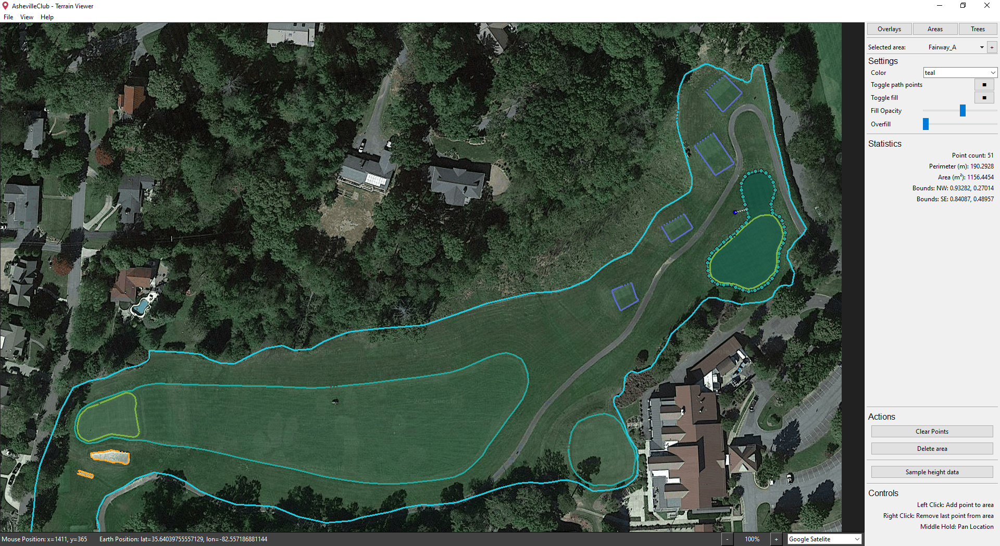

# Golf Course Data Processors
A collection of tools to process data for further analysis on modeling golf courses and strategy optimization.

## Installation
1. With the project directory as the current working directory, enter:
    ```
    pip install -r .\required_packages.txt
    ```

2. For Terrain Grabber, a google cloud API key, specifically google maps, is required to run the program on startup. More information can be found at [Getting started with Google Maps Platform](https://developers.google.com/maps/get-started). Any API keys will be kept in a .env file that will be ignored by git.

## Terrain Grabber
```
python run.py <area-name>
```



### Features:
 - Pull satelite imagery and elevation data through the Google Maps API.
 - Draw out or import areas of interest to pull finer elevation data.
 - From elevation data, generate gradient-based elevation maps and contour maps.
 - Usage data is tracked locally to stay under the free monthly quota of $200 (as of August 2022).
 - Organize and export processed data and metadata for further data analysis. For ease of use:
     - Convert latitude and longitude units into metric or imperial units in reference to a user defined origin point.
     - Export areas of interest as binary images or a list of coordinate.
     - Export elevation data as imagery or raw data in csv form.

## License
This project is licensed under the MIT - see the LICENSE.md file for details.